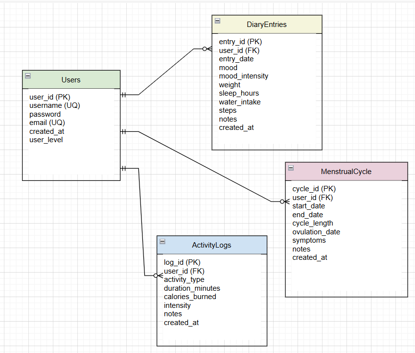
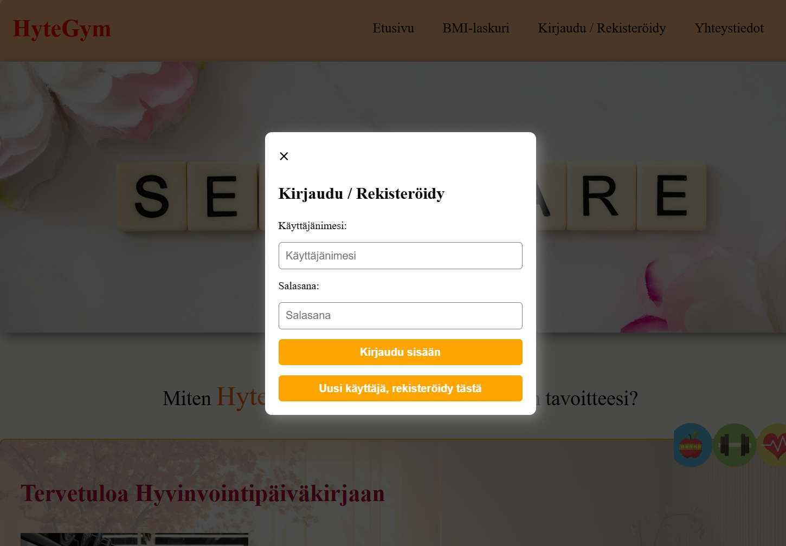
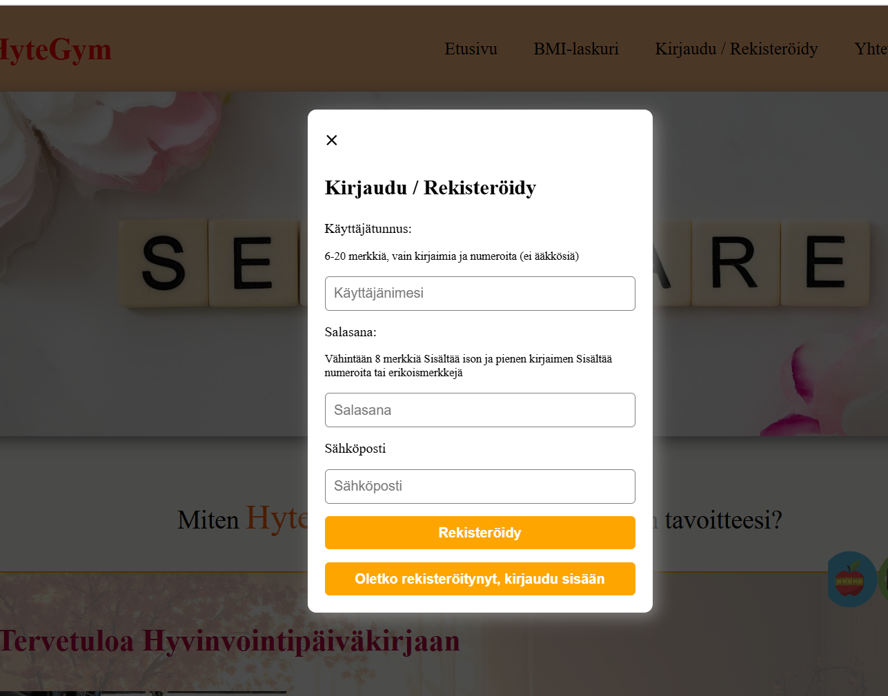
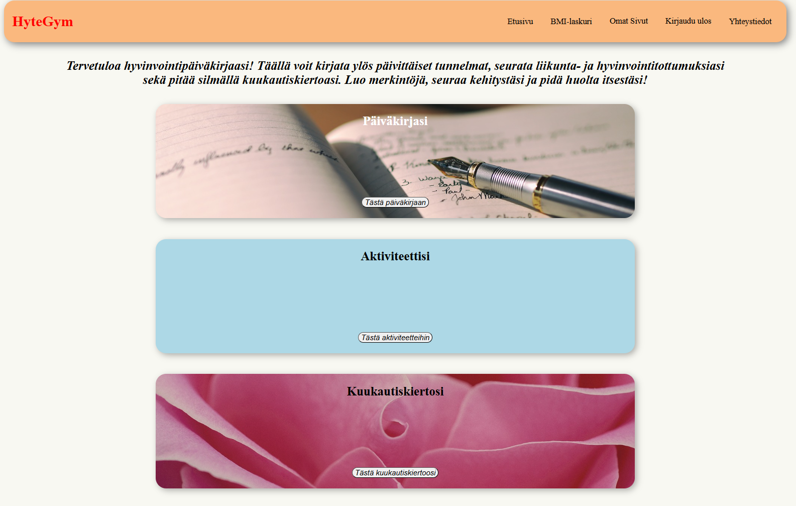
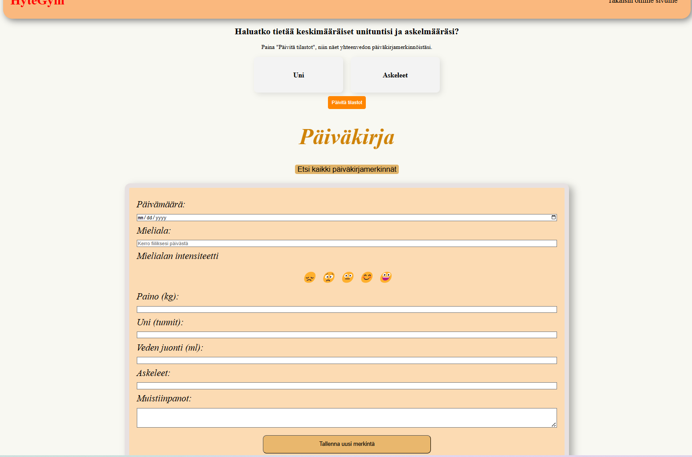
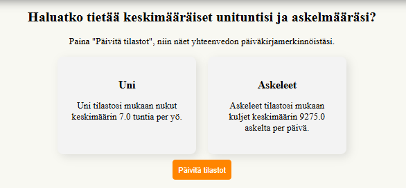
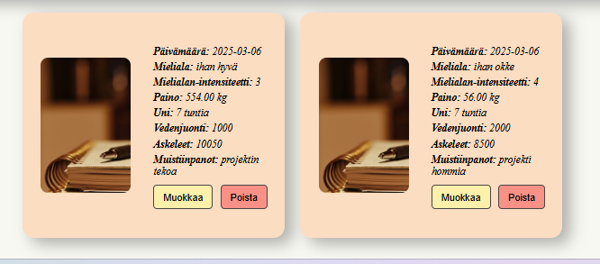
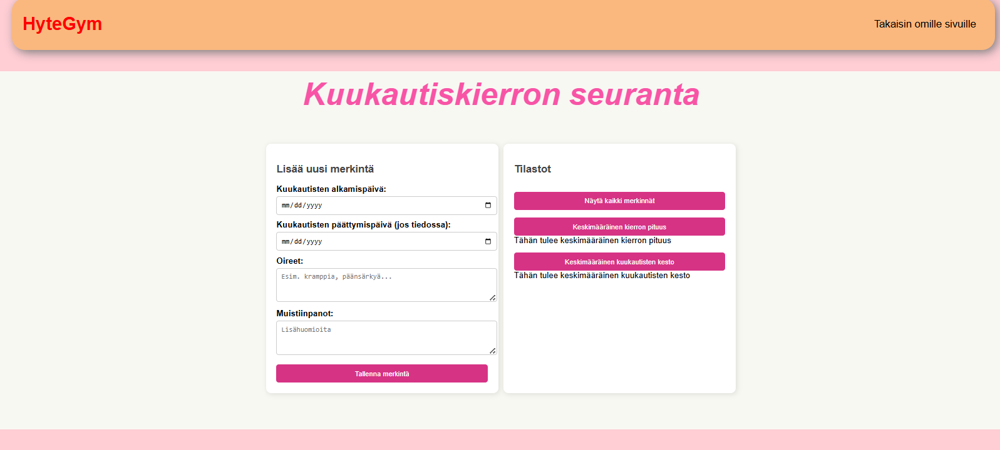
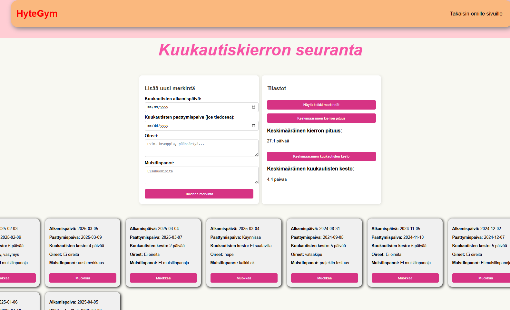
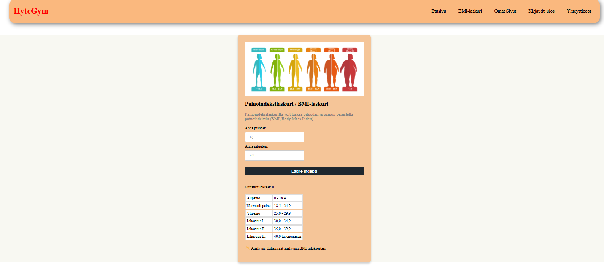

# Yksilöprojekti Suvi Westerberg  MyHealthDiary

Tämä on MyHealthDiary-sovelluksen backend. Sovellus auttaa käyttäjiä seuraamaan hyvinvointiaan päiväkirjamerkinnöillä ja tilastoilla.

## Linkit
- **Sovellus (Front-end)**: [http://localhost:5173](http://localhost:5173)
- **API (Back-end)**: [http://localhost:3000](http://localhost:3000)
- **API-dokumentaatio (Apidoc)**: [http://localhost:3000/api](http://localhost:3000/api)

## Tietokanta. Tein backendin uudelleen, en siis käytä sitä koulussa tehtyä vaan rakensin uuden niiden ohjeiden avulla.

- **Users**: Käyttäjätiedot ja kirjautumistiedot
- **DiaryEntries**: Päiväkirjamerkinnät (uni, askeleet, vedenjuonti jne.)
- **ActivityLogs**: Liikuntamerkinnät (ei toteutettu)
- **MenstrualCycle**: Kuukautiskierron merkinnät

Alla on sovelluksen tietokantarakenne, joka sisältää taulut ja yhteydet.

## Toteutetut ja toteuttamatta jääneet toiminnot
## HUOM! Vaikka kaikkia suunniteltuja toimintoja en ehtinyt toteuttaa, tietokantarakenne ja API reittejä on suunniteltu niiden mahdollistamiseksi.

### Toteutetut
- Etusivu
- bmi-sivu
- yhteystiedot sivu (joka ei oikeastaan ole sovelluksessa tärkeä kun ei ole fyysistä lokaatiota mutta tein sen ennenkuin projektin suunnitelma oli täysin selvillä)
- omat-sivut kirjautuneelle
- Käyttäjän rekisteröinti ja kirjautuminen
- Päiväkirjamerkintöjen tekeminen
- Päiväkirjamerkintöjen muokkaaminen
- Päiväkirjamerkintöjen poistaminen
- Kuukautiskierron seuranat/päiväkirja osio
- Kuukautisten merkinnän lisääminen
- Kuukautiskierron muokkaaminen
- Keskimääräisen kuukautisten keston laskeminen
- Keskimääräisen kierron pituuden laskeminen
- Sovelluksesta ulos kirjautuminen
- käytetty modaalia, snackbaria ja alerttia

### Toteuttamatta jääneet
- Kaikki ActivityLogs tauluun liittyvät ominaisuudet
- Omien käyttäjätietojen näkeminen/muokkaaminen/poistaminen
- Kuukautiskiertojen poistaminen
- Ovulaatio ajan laskeminen / arvioiminen
- Kaikkea hienosäätöä, käyttäjä ilmoituksia / virheilmoituksia en ehtinyt tekemään, kokoajan tuli uusia juttuja että ainiin tuokin voisi olla noin ja tuossa tuollainen.

## komentoja hauille, testattu Postmanilla
### Käyttäjän rekisteröinti
- POST http://localhost:3000/api/users/
lisää kenttään esim
{
  "username": "testikayttaja",
  "email": "testaus@example.com",
  "password": "testisalasana"
}

### Kirjaudu sisään
- POST http://localhost:3000/api/users/login
{
  "username": "testikayttaja",
  "password": "testisalasana"
}

saat tokenin, kopioi se ja katso omat tiedot:
### Katso omat tietosi
GET http://localhost:3000/api/users/me
Authorization Bearer <your token>

### Lisätty tilastojen (uni, askeleet, juotu vedenmäärä) haku diaryentriesille

#### testikoodit postmanilla
 - POST http://localhost:3000/api/diary
 Authorization Bearer  <token>
 - GET  http://localhost:3000/api/diary
 - GET  http://localhost:3000/api/diary/1 (yksittäisen merkinnän hakeminen)
 - PUT http://localhost:3000/api/diary/1
 - DELETE http://localhost:3000/api/diary/1
 - GET http://localhost:3000/api/diary/stats/sleep

 - POST http://localhost:3000/api/activity
 - GET http://localhost:3000/api/activity
 - PUT http://localhost:3000/api/activity/1

### Kuukautiskierron reittejä en etukäteen testaillut Postmanilla.
- GET http://localhost:3000/api/cycle
- GET http://localhost:3000/api/cycle/stats/average-cycle-length
- GET http://localhost:3000/api/cycle/stats/average-menstruation-length
- POST http://localhost:3000/api/api/cycle
- PUT http://localhost:3000/api/api/cycle/:id

## Kuvakaappaukset
### Alla olevat kuvakaappaukset esittävät sovelluksen eri osia ja toiminnallisuuksia

### Etusivu

### Kirjautuminen

### Rekisteröityminen

### Omat sivut

### Päiväkirja

### Päiväkirjan tilastot

### Päiväkirjamerkintä

### Kuukautiskierto

### Kuukautiskierron tilastot

### BMI-laskuri

### Yhteystiedot

